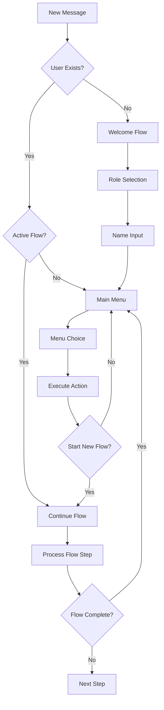

# Kijumbe WhatsApp Bot - Node.js Implementation Guide

## Overview

This is a complete Node.js WhatsApp bot implementation for the Kijumbe Rotational Savings platform. It replaces the previous Python bot with a modern, menu-driven system using Green API v2.0.

## 🚀 Features

### Core Features
- **Menu-driven conversation flow** with intuitive navigation
- **User registration and role management** (Kiongozi/Mwanachama)
- **Group creation and joining** with unique group codes
- **Contribution processing** with transaction tracking
- **Balance and history tracking** for all users
- **Interactive help system** in Swahili
- **Session management** with automatic cleanup
- **Real-time message polling** from Green API

### Bot Capabilities
- 📱 **Multi-language support** (Swahili primary)
- 🔐 **Secure user authentication** via phone numbers
- 💰 **Financial transaction processing**
- 👥 **Group management** for leaders
- 📊 **Balance and history reporting**
- 🆘 **Context-aware help system**
- ⚡ **Real-time message handling**

## 🛠️ Installation & Setup

### Prerequisites
- Node.js v16+ and npm
- Green API WhatsApp Business API account
- Appwrite database setup
- Environment variables configured

### Installation Steps

1. **Install Dependencies**
   ```bash
   npm install
   ```

2. **Configure Environment**
   Copy `env.example` to `.env` and configure:
   ```env
   # Green API Configuration
   GREENAPI_ID_INSTANCE=your_instance_id
   GREENAPI_API_TOKEN_INSTANCE=your_api_token
   GREENAPI_API_URL=https://7105.api.greenapi.com
   GREENAPI_BOT_PHONE=255738071080
   GREENAPI_WEBHOOK_URL=https://your-domain.com/backend/whatsapp/webhook
   
   # Appwrite Configuration
   APPWRITE_ENDPOINT=https://fra.cloud.appwrite.io/v1
   APPWRITE_PROJECT_ID=your_project_id
   APPWRITE_API_KEY=your_api_key
   ```

3. **Test Bot Functionality**
   ```bash
   npm run test:bot
   ```

## 🎮 Usage Commands

### Development
```bash
# Start bot only (development)
npm run bot:dev

# Start bot only (production)
npm run bot:prod

# Start bot + server together
npm run start:all
```

### Production
```bash
# Start bot in production mode
npm run bot:prod

# Start complete system (recommended)
npm run start:all
```

### Windows Batch Scripts
```batch
# Start bot only
start-bot.bat

# Start complete system
start-complete.bat
```

## 📱 Bot User Interface

### Welcome Flow
1. **New User Greeting**
   - Welcome message in Swahili
   - Role selection (Kiongozi/Mwanachama)
   - Name registration

2. **Main Menu Structure**
   ```
   🏠 MENYU KUU - [User Name]
   
   1️⃣ Ona Vikundi Vyangu
   2️⃣ Toa Mchango / Kusimamia Michango
   3️⃣ Ona Salio Langu
   4️⃣ Historia ya Miamala
   5️⃣ Unda Kikundi / Jiunge na Kikundi
   6️⃣ Mipangilio
   7️⃣ Msaada
   0️⃣ Rudisha Menyu
   ```

### User Roles

#### Kiongozi (Leader)
- Create and manage groups
- View group statistics
- Monitor member contributions
- Access admin features
- Generate reports

#### Mwanachama (Member)
- Join groups using group codes
- Make contributions
- View personal balance
- Track transaction history
- Access member features

## 🏗️ Bot Architecture

### Core Components

1. **KijumbeWhatsAppBot Class**
   - Main bot controller
   - Message polling and handling
   - State management
   - API communication

2. **Session Management**
   - User conversation states
   - Flow tracking
   - Automatic cleanup

3. **Database Integration**
   - Appwrite database connection
   - User, group, and transaction management
   - Real-time data synchronization

4. **Green API Integration**
   - Message sending/receiving
   - Instance status monitoring
   - Webhook support

### Conversation Flows



## 🔧 Configuration

### Environment Variables
```env
# Required Green API Settings
GREENAPI_ID_INSTANCE=7105299826
GREENAPI_API_TOKEN_INSTANCE=your_token
GREENAPI_API_URL=https://7105.api.greenapi.com
GREENAPI_BOT_PHONE=255738071080

# Optional Settings
GREENAPI_WEBHOOK_URL=https://your-domain.com/webhook
GREENAPI_POLLING_INTERVAL=2000
GREENAPI_SESSION_TIMEOUT=1800000

# Database Settings
APPWRITE_ENDPOINT=https://fra.cloud.appwrite.io/v1
APPWRITE_PROJECT_ID=68ac2652001ca468e987
APPWRITE_API_KEY=your_api_key
```

### Bot Configuration
- **Polling Interval**: 2 seconds (configurable)
- **Session Timeout**: 30 minutes
- **Message Timeout**: 10 seconds
- **Auto-cleanup**: Yes
- **Multi-language**: Swahili primary

## 📊 Monitoring & Logging

### Bot Status Monitoring
```javascript
// Get bot status
const status = bot.getStatus();
console.log('Bot Status:', status);
// Output: { isRunning: true, activeSessions: 5, instanceId: "7105299826", botPhone: "255738071080" }
```

### Logging Features
- Real-time message logging
- Error tracking and reporting
- Performance monitoring
- Session activity tracking

### Health Checks
```bash
# Test bot initialization
npm run test:bot

# Check bot status programmatically
node -e "console.log(require('./services/whatsapp-bot-nodejs').getStatus())"
```

## 🔒 Security Features

### Authentication
- Phone number-based user identification
- Session token management
- API key protection
- Webhook security

### Data Protection
- Secure message transmission
- Encrypted database storage
- Privacy compliance
- Access control

## 🐛 Troubleshooting

### Common Issues

1. **Bot Not Receiving Messages**
   ```bash
   # Check instance status
   curl "https://7105.api.greenapi.com/waInstance{INSTANCE_ID}/getStateInstance/{API_TOKEN}"
   ```

2. **Database Connection Issues**
   ```bash
   # Test Appwrite connection
   node -e "require('./config/appwrite').databases.listCollections().then(r => console.log('✅ DB Connected')).catch(e => console.error('❌ DB Error:', e))"
   ```

3. **Environment Configuration**
   ```bash
   # Validate environment
   node -e "console.log('Config:', {instance: process.env.GREENAPI_ID_INSTANCE, endpoint: process.env.APPWRITE_ENDPOINT})"
   ```

### Debug Mode
```bash
# Enable debug logging
DEBUG=true npm run bot:dev
```

### Error Handling
- Automatic retry on API failures
- Graceful degradation
- User-friendly error messages
- Admin notifications

## 📈 Performance

### Optimization Features
- Efficient message polling
- Session caching
- Database query optimization
- Memory management

### Scalability
- Horizontal scaling support
- Load balancing ready
- Multi-instance deployment
- Cloud-native architecture

## 🔄 Updates & Maintenance

### Regular Maintenance
```bash
# Update dependencies
npm update

# Clean old sessions
node -e "require('./services/whatsapp-bot-nodejs').cleanupOldSessions()"

# Restart bot service
npm run bot:prod
```

### Backup & Recovery
- Automated database backups
- Configuration versioning
- Rollback procedures
- Disaster recovery

## 📚 API Reference

### Bot Methods
```javascript
const bot = new KijumbeWhatsAppBot();

// Start/stop bot
await bot.start();
bot.stop();

// Send messages
await bot.sendMessage(phoneNumber, message);

// Get status
const status = bot.getStatus();

// Cleanup
bot.cleanupOldSessions();
```

### Integration Examples
```javascript
// Custom message handler
bot.on('message', (phoneNumber, message) => {
  console.log(`Message from ${phoneNumber}: ${message}`);
});

// Error handling
bot.on('error', (error) => {
  console.error('Bot error:', error);
});
```

## 🎯 Migration from Python Bot

### Key Differences
- **Architecture**: Event-driven vs polling-based
- **Performance**: Faster message processing
- **Features**: Enhanced menu system
- **Maintenance**: Easier debugging and monitoring

### Migration Steps
1. Stop Python bot service
2. Deploy Node.js bot
3. Test functionality
4. Update webhook configurations
5. Monitor performance

## 📞 Support

### Contact Information
- **WhatsApp**: +255738071080
- **Email**: support@kijumbe.co.tz
- **Website**: www.kijumbe.co.tz

### Documentation
- [Green API Documentation](https://green-api.com/docs/)
- [Appwrite Documentation](https://appwrite.io/docs)
- [Node.js Best Practices](https://nodejs.org/en/docs/guides/)

---

## 🏁 Quick Start

```bash
# 1. Clone and setup
git clone <repository>
cd kijumbe

# 2. Install dependencies
npm install

# 3. Configure environment
cp env.example .env
# Edit .env with your credentials

# 4. Test bot
npm run test:bot

# 5. Start bot
npm run bot

# 6. Start complete system
npm run start:all
```

**🎉 Your Kijumbe WhatsApp Bot is now ready for rotational savings automation!**
